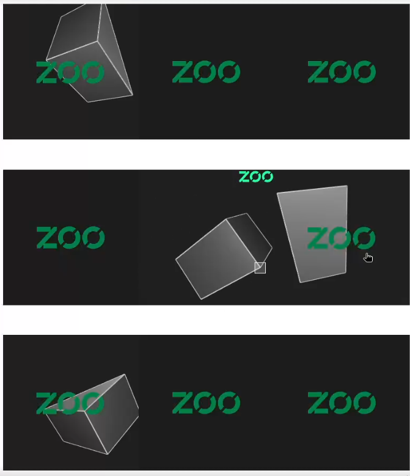

# @kittycad/web-view

Various helpers to get a Zoo KittyCAD WebRTC stream onto a web page!

## Features

* Each instance runs on a Web Worker, preventing main worker blocking.
* Take KCL as a string input, or a map of `path -> string`s.
* Supports raw scene and modeling commands.
* Managed multiplexing so that many can be used at once on a page.
* Supports Zoo camera controls (middle to pan, right to rotate, wheel to zoom).
* Written in vanilla JavaScript for easy porting to other frameworks.

## Installation

```sh
npm install @kittycad/web-view @kittycad/lib
```

## Quick demo

```sh
make serve
```

## Building

```sh
make build
```

## Example

```ts
import * as zoo from '@kittycad/lib'
import { ZooWebView } from '@kittycad/web-view'

document.addEventListener('DOMContentLoaded', () => {
  const token = 'api-xxxxxxxx-xxxx-xxxx-xxxx-xxxxxxxxxxxx'

  const zooClient = new zoo.Client({
    token,
    baseUrl: 'wss://api.dev.zoo.dev',
  })

  const zooWebView = new ZooWebView({
    zooClient,
    size: {
      width: 256,
      height: 256,
    },
  })
  
  document.body.appendChild(zooWebView.el)
  
  zooWebView.addEventListener('ready', (ev: Event) => {
    const executor = ev.target.rtc.executor()
    const project = new Map<string, string>()
    project.set('main.kcl', `
      import "ok.kcl"
      sketch001 = startSketchOn(XY)
      profile001 = startProfile(sketch001, at = [-3.5, -2.23])
        |> line(end = [4.53, 5.73])
        |> line(end = [5.18, -3.74])
        |> line(endAbsolute = [profileStartX(%), profileStartY(%)])
        |> close()
      extrude001 = extrude(profile001, length = 5 * 1)
      |> appearance(color="#0000FF")
    `)
    project.set('ok.kcl', `
      sketch001 = startSketchOn(XY)
      profile001 = startProfile(sketch001, at = [-1.5, -2.23])
        |> line(end = [4.53, 5.73])
        |> line(end = [5.18, -3.74])
        |> line(endAbsolute = [profileStartX(%), profileStartY(%)])
        |> close()
      extrude001 = extrude(profile001, length = 5 * 1)
      |> appearance(color="#FF0000")
    `)
    void executor.submit(project).then(() => {
      console.log('All done running!')
    })
  })
})
```

## Pretty screenshot of making tons of these

